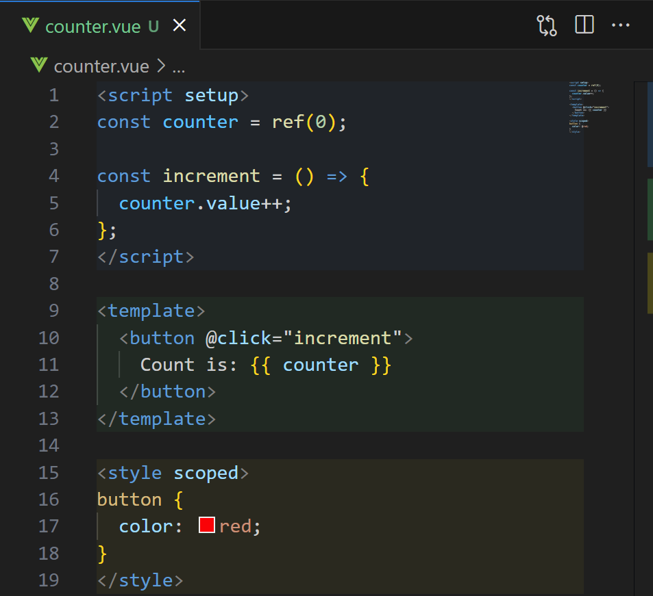
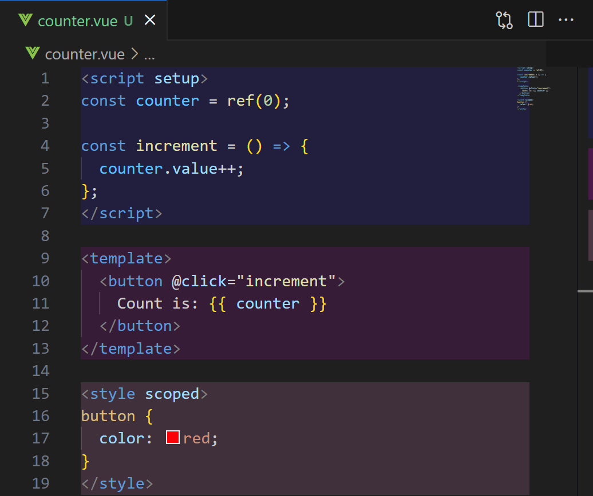
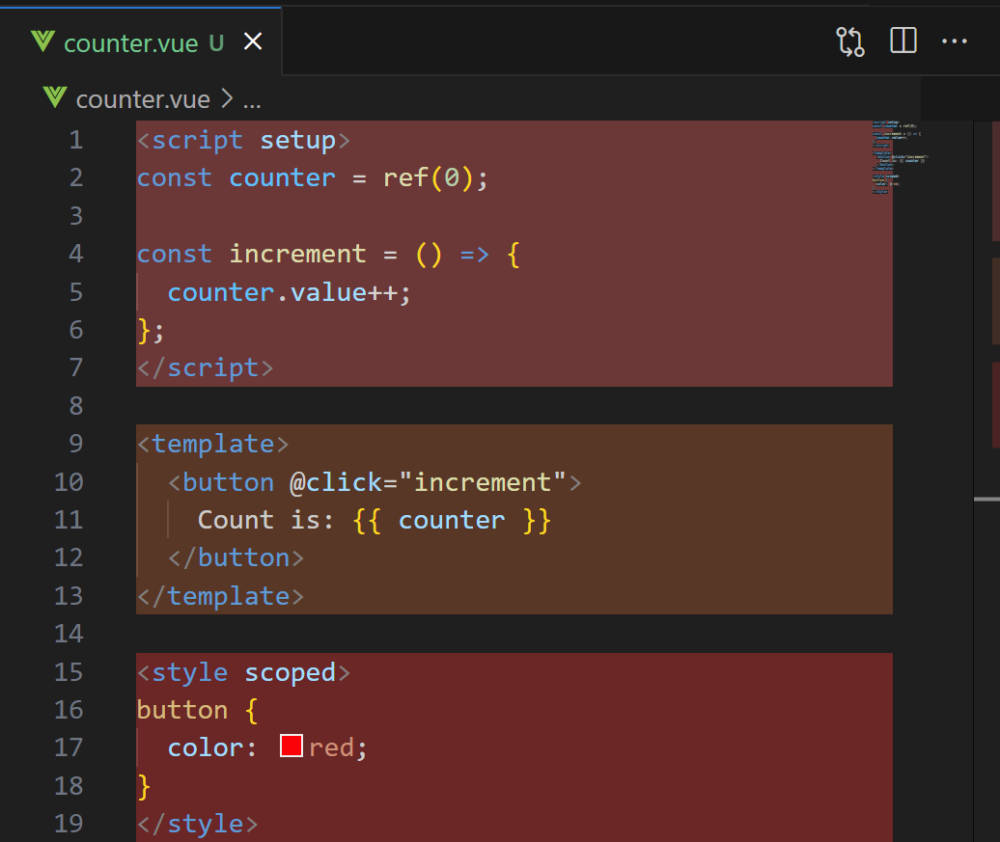
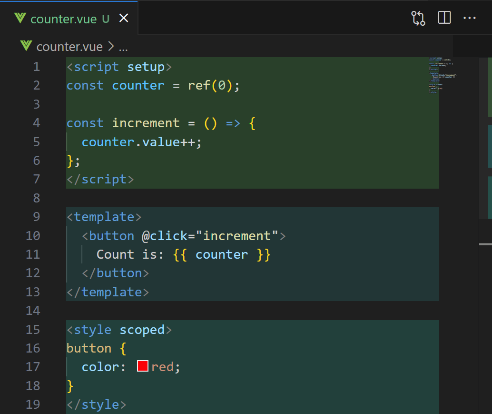
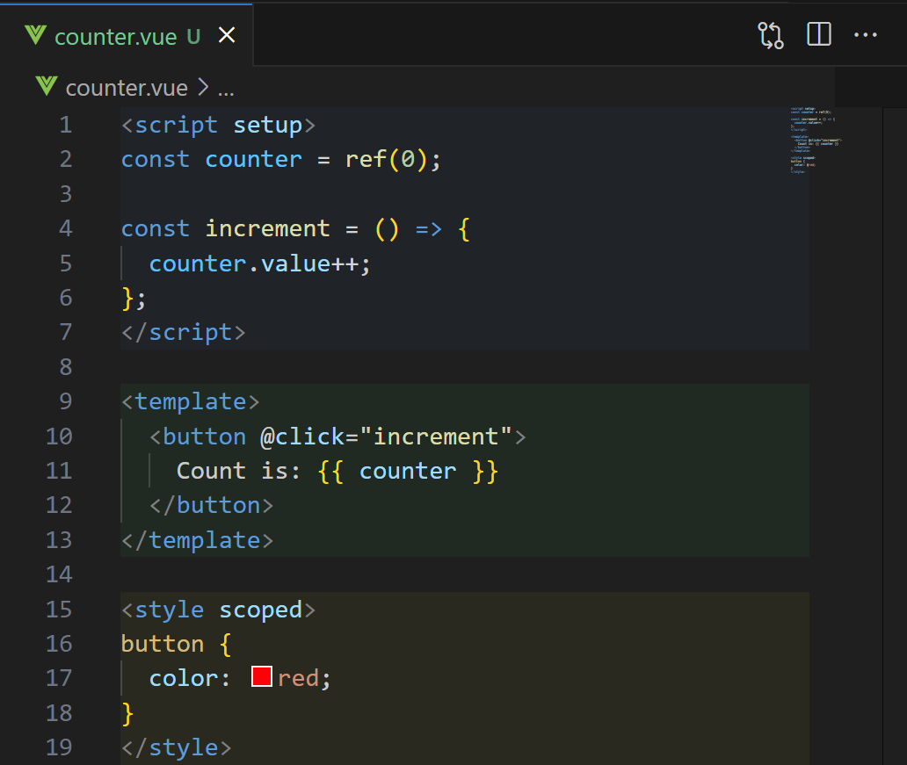
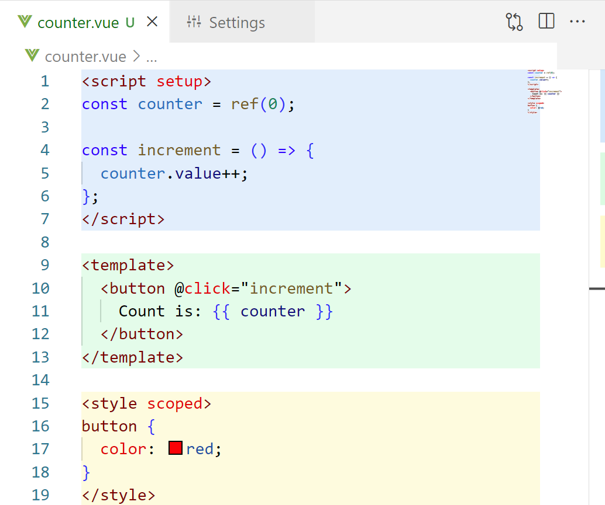
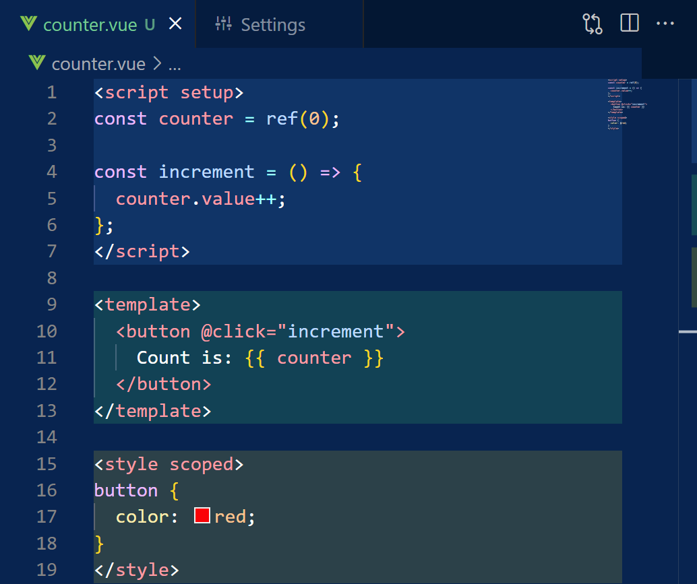
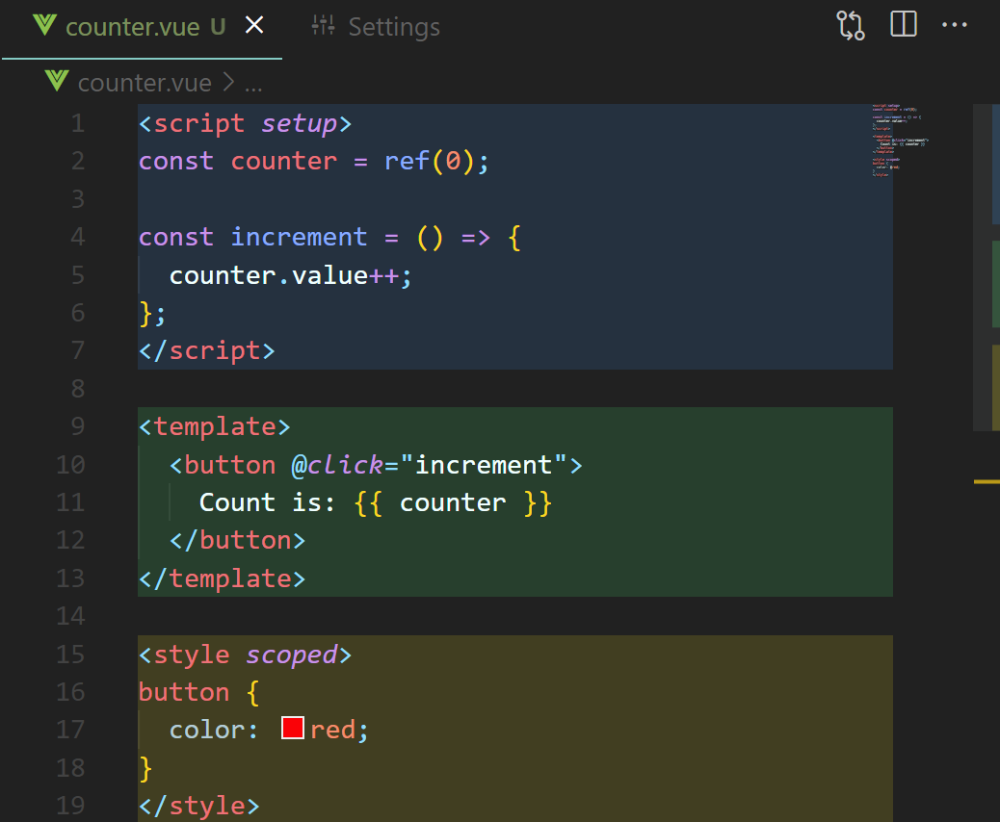
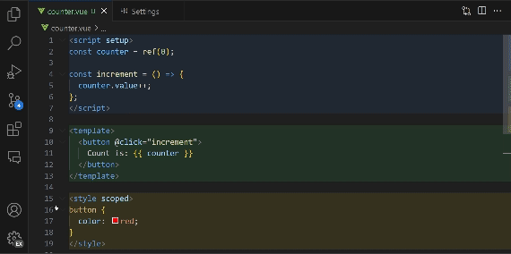

# Stay organized 

With clear highlighting of your Vue code, never lose track of where you are in your Vue documents.

Choose any colors to highlight either the entire line, the scrollbar or both!

## Features

Vue Colors is meant to bring more clarity to your Vue documents. It highlights your Vue code based on functionality (script, template, style) and allows you to easily see where you are in your Vue documents. This enhances your productivity and makes it easier to navigate through (large) files. Additionally, it makes your code look more organized and visually appealing.

Vue Colors is fully customizable, allowing you to change the colors to whatever you like, and choose what to highlight (the entire line, the scrollbar or both). The extension works with any number of `<template>`, `<script>` and `<style>` tags in any order!

Any other feature requests? Please let me know by creating an issue on the [GitHub repository](https://github.com/VasilVerdouw/vue-colors/issues)!

### Personalize your colors

Change your highlighting colors to whatever you like! Vue Colors supports any RGBA colors.

### Choose what to highlight

Highlight either the entire line, the scrollbar or both!

*Only the scrollbar*

*Only the line*

*Both the line and the scrollbar*

### Works with any theme

Vue Colors works with any theme, and will always be visible!

If you think the default colors dont match with your theme, you can always change them to your liking.

*Theme: Light+*

*Theme: Tomorrow Night Blue*

*Theme: community material theme darker*

### Easily change any settings

Use the VS Code settings menu to easily make Vue Colors exactly how you want it to be.

## Extension Settings

Vue Colors has a few settings to personalize your experience.

All of these settings can be found and changed by opening the settings menu and searching for "Vue Colors".

* `vueColors.scriptColor`: The background color of the javascript/typescript code (please use rgba only). Used for both line color and scrollbar color. Default: `rgba(36, 142, 237, 0.10)`

* `vueColors.htmlColor`: The background color of the HTML template code (please use rgba only). Used for both line color and scrollbar color. Default: `rgba(69, 237, 108, 0.10)`

* `vueColors.styleColor`: The background color of the (S)CSS code (please use rgba only). Used for both line color and scrollbar color. Default: `rgba(255, 230, 0, 0.10)`

* `vueColors.highlightLine`: Wether to highlight the entire line using the specified colors. Default: `true`

* `vueColors.highlightScrollbar`: Wether to highlight the right side of the scrollbar using the specified colors. (Colors will be slightly less transparent on the scrollbar to make it more visible). Default: `true`

## Known Issues & Contributing

If you find any issues or want to contribute, please check the [GitHub repository](https://github.com/VasilVerdouw/vue-colors).
