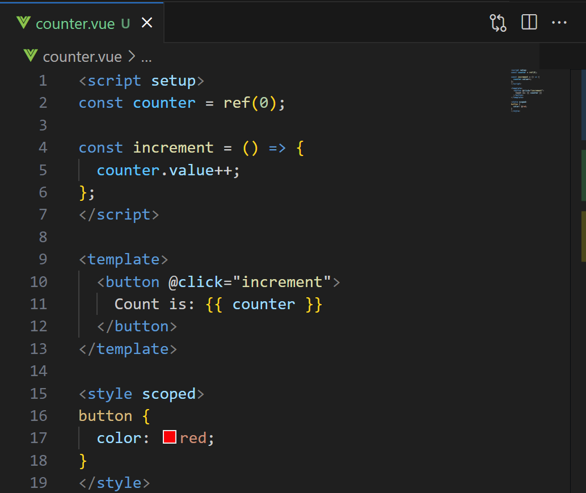

# Stay organized 

With clear highlighting of your Vue code, never lose track of where you are in your Vue documents.

Choose any colors to highlight either the entire line, the scrollbar or both!

## Features

### Personalize your color

Vue Colors supports any RGBA color

### Choose what to highlight

Highlight either the entire line, the scrollbar or both!

*Only the scrollbar*

*Only the line*

*Both the line and the scrollbar*

### Works with any theme

Vue Colors works with any theme, and will always be visible.

*Theme: Light+*

*Theme: Tomorrow Night Blue*

*Theme: community material theme darker*

## Extension Settings

Vue Colors has a few settings to personalize your experience.

All of these settings can be found and changed by opening the settings menu and searching for "Vue Colors".

* `vueColors.scriptColor`: The background color of the javascript/typescript code (please use rgba only). Used for both line color and scrollbar color. Default: `rgba(36, 142, 237, 0.10)`

* `vueColors.htmlColor`: The background color of the HTML template code (please use rgba only). Used for both line color and scrollbar color. Default: `rgba(69, 237, 108, 0.10)`

* `vueColors.styleColor`: The background color of the (S)CSS code (please use rgba only). Used for both line color and scrollbar color. Default: `rgba(255, 230, 0, 0.10)`

* `vueColors.highlightLine`: Wether to highlight the entire line using the specified colors. Default: `true`

* `vueColors.highlightScrollbar`: Wether to highlight the right side of the scrollbar using the specified colors. (Colors will be slightly less transparent on the scrollbar to make it more visible). Default: `true`

## Known Issues & Contributing

If you find any issues or want to contribute, please check the [GitHub repository](https://github.com/VasilVerdouw/vue-colors).
